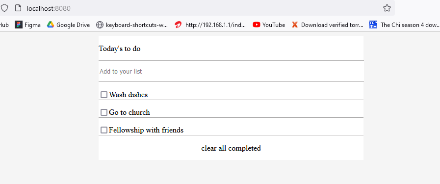

# To Do List App

> An application that helps one to create daily tasks for easy remeberance.

The app will have features like adding, deleting, editing task 

## Built With

- Html, CSS, JavaScript
- Webpack

## Getting Started

**This is an example of how you may give instructions on setting up your project locally.**
**Modify this file to match your project, remove sections that don't apply. For example: delete the testing section if the currect project doesn't require testing.**

To get a local copy up and running follow these simple example steps.

### Prerequisites
- Node.js

### Setup
- Clone the repository.

### Install
1. `cd` into the repository's folder.
2. Enter `npm install` into the terminal.
3. Enter `npm run build` into the terminal.
3. Run the dist\index.html file.

## 👤 Author1:

- [Github](https://github.com/ayebaishmo)
- [Twitter](https://twitter.com/ishmo256)

🤝 Contributing:

- Contributions, issues, and feature requests are welcome!

## Show your support

Give a ⭐️ if you like this project!